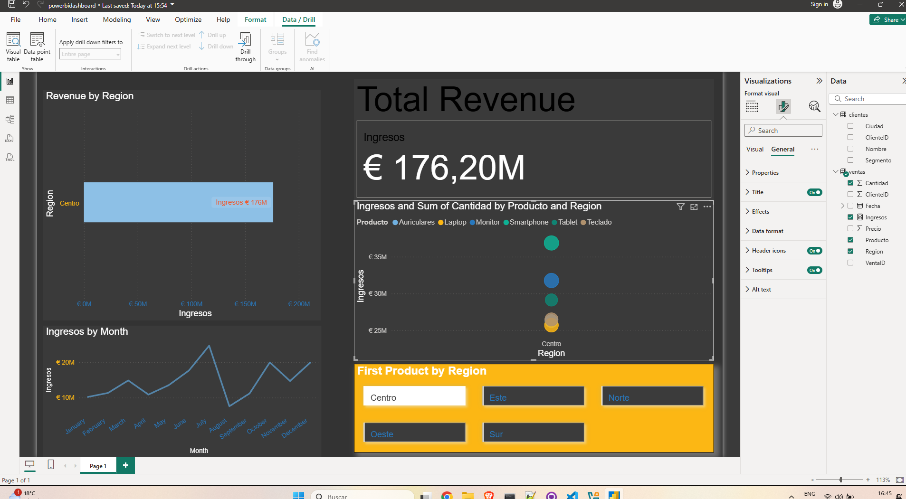
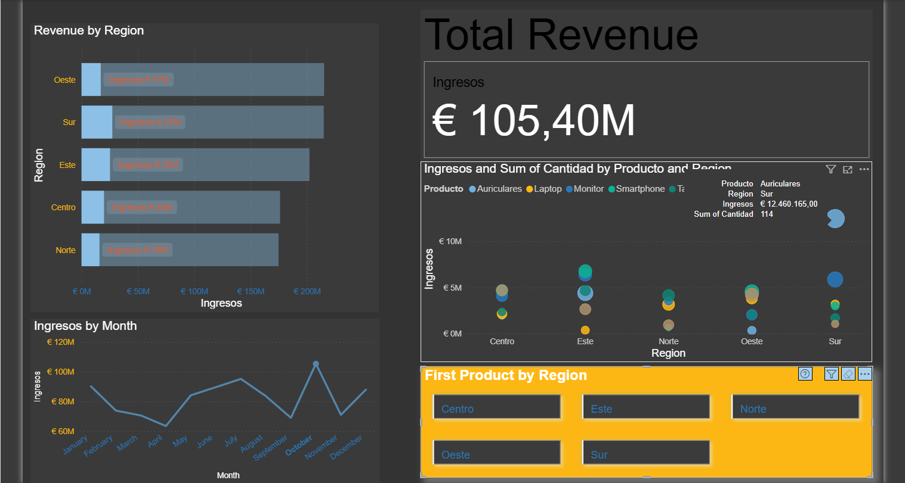

# Sales-Dashboard-SQL-PowerBI

## Sales Dashboard (SQL, Python & Power BI)

This project highlights my skills as a junior data analyst. I generated data using **Python** and **SQL**, cleaned it, and built an interactive dashboard in **Power BI** to demonstrate my ability to analyze and visualize data effectively.

### Environment Setup
This project utilizes a **devcontainer** to ensure a reproducible environment in GitHub Codespaces:
1. Open the repository in Codespaces.
2. The devcontainer automatically installs SQLite, Python 3.11, and pandas.
3. Run the scripts in `scripts/` to create the database and generate data.
4. (Optional) Start Metabase with `java -jar metabase/metabase.jar` for alternative visualizations.

### Description
- **Database**: SQLite with relational tables (`Ventas`, `Clientes`).
- **Data Generation**: Python script for realistic data.
- **Visualization**: Power BI dashboard with revenue metrics, segmentation, trends, and advanced visualizations.
- **Environment**: Developed in GitHub Codespaces.

### Project Structure

Sales-Dashboard-SQL-PowerBI/
├── .devcontainer/
│   ├── devcontainer.json
│   ├── setup.sh
├── data/
│   ├── ventas.db
│   ├── ventas.csv
│   ├── clientes.csv
├── scripts/
│   ├── database.sql
│   ├── generar_datos.py
├── powerbi/
│   ├── powerbidashboard.pbix
│   ├── screenshot1.png
│   ├── screenshot2.png
├── README.md

- **.devcontainer/**: Contains configuration files for a reproducible environment in GitHub Codespaces.
- **data/**: Stores the SQLite database (`ventas.db`) and exported CSV files (`ventas.csv`, `clientes.csv`).
- **scripts/**: Includes SQL (`database.sql`) and Python (`generar_datos.py`) scripts for data generation.
- **powerbi/**: Contains the Power BI dashboard file (`powerbidashboard.pbix`) and project screenshots (`screenshot1.png`, `screenshot2.png`).

### Instructions to Reproduce
1. Clone the repository: `git clone https://github.com/tu-usuario/Sales-Dashboard-SQL-PowerBI.git`.
2. Open in Codespaces and install dependencies: `sudo apt update && sudo apt install sqlite3 python3-pip && pip install pandas`.
3. Create the database: `sqlite3 data/ventas.db < scripts/database.sql`.
4. Generate data: `python3 scripts/generar_datos.py`.
5. Export CSVs: Use the provided SQLite commands.
6. Open `powerbi/powerbidashboard.pbix` in Power BI Desktop.

### Visualizations
- **Bar Chart**: Revenue by Region - Displays total revenue segmented by region.
- **Card**: Total Revenue - Presents the overall sales figure in currency with a clear, large display.
- **Line Chart**: Revenue Trends by Month - Illustrates sales trends over time.
- **Bubble Chart**: Sales by Region - Visualizes revenue and quantity with interactive bubbles.
- **Interactive Filters (Slicers)**: Filters for Region and Product - Allows dynamic filtering of the dashboard.

### Screenshots

### Technologies and Skills
- **SQL**: Advanced queries with joins, aggregations, subqueries, and database schema corrections.
- **Python**: Automated data generation and error handling.
- **Power BI**: Creation of interactive dashboards, including bar charts, line charts, bubble charts, cards, and slicers.
- **GitHub Codespaces**: Cloud development with reproducible environments using devcontainers.
- **Version Control**: Use of Git for change management and collaboration.

### Improvements Made
To enhance this project, I initially attempted to integrate latitude and longitude data to create an interactive map visualization. Although I decided to abandon this feature due to its complexity, I improved the database schema and Python script to include the `Latitud` and `Longitude` columns in the `Clientes` table. This demonstrates my ability to adapt data structures and handle geographic data. If desired, I can further improve the project by:
- Reintegrating an interactive map using the existing latitude and longitude data for geographic sales analysis.
- Adding more interactive elements or advanced visualizations to deepen the analysis.

### Contact
Add your LinkedIn or email for recruiters to contact you (e.g., [your-email] or [your-LinkedIn]).

Last updated: July 24, 2025